## Interactive Frontend Development Milestone Project 2 -- Reservations of Northshore

Have been living in Northshore of Massachussetts for more than 30 years I really enjoyed these Reservations thanks to the Trustess of Reservations and Greenbelt of Essex County's Land Trust.  I hope this website will let users get to know these beautiful places in Northshore and come to visit, enjoy the nature and histroy, become a member and support these wonderful organizations.

My website can be accessed [here](https://suping106.github.io/MS2-NorthShore-Reservations/)

## UX

### As a user
- I can have a brief glance of the reservations in Northshore when the website was opened.
- I can navigate through different sections in the page.
- I get to know these wonderful reservations in Northshore.
- I can clearly see the locations of these places with markers on the Google Map.
- I can click or tap a maker on the map to see the name and the photo of the reservation.
- I can have info cards with photo and infromation about the place as well as the link to the reservation.
- I can access the web page of each Reservation for more information.
- I can contact website owner through email for questions or comments.
- I can sign up to be a member.

### As a website owner
- I want the users to come and enjoy these beautiful places.
- I want to introduce users to the great work that Trustees and Greenbelt have done in preserving local lands and histroy.
- I hope people would like to become a member and support the Trustees and Greenbelt.

### Responsive design
User can browse this website on different devices.

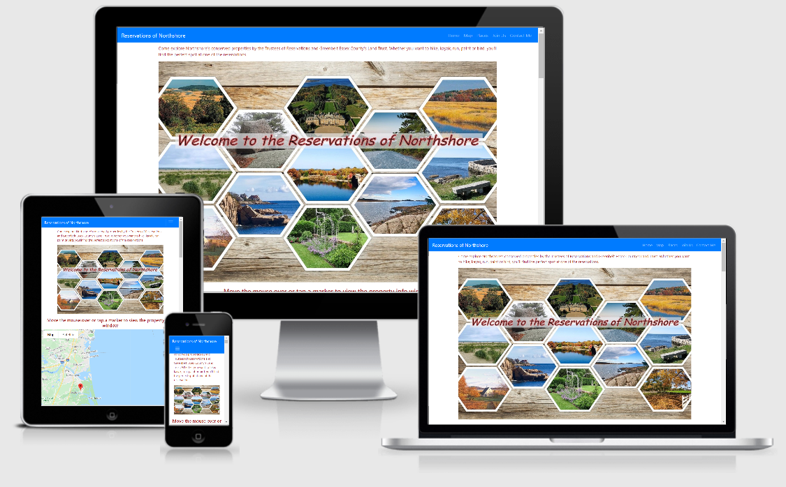

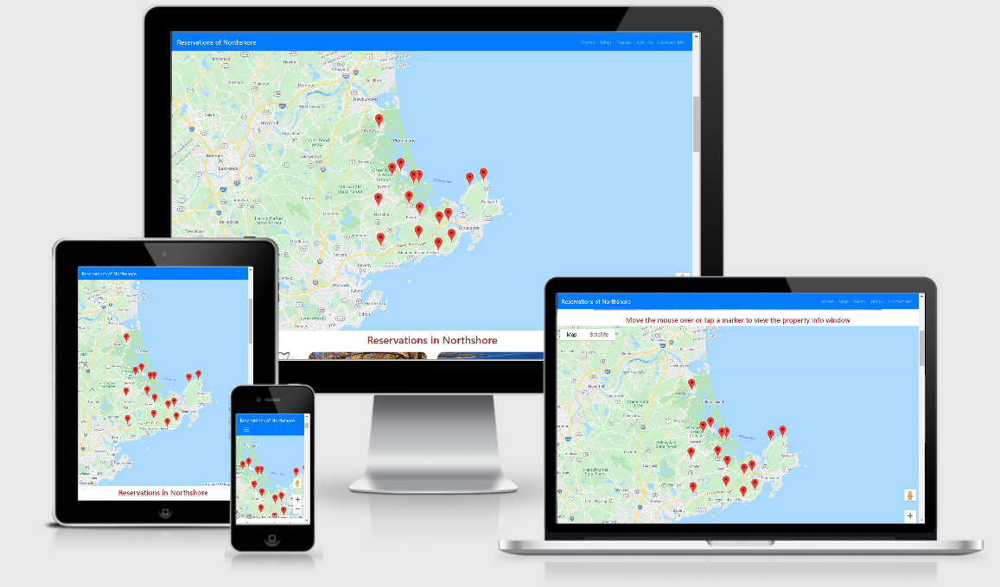

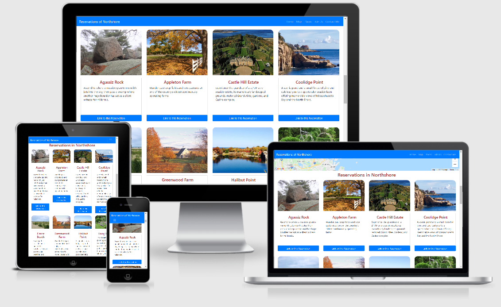

## Wireframes

Figma was used to creat the wireframes for the original design of the project. During the development phase some modifications and improvements were made to the project. 

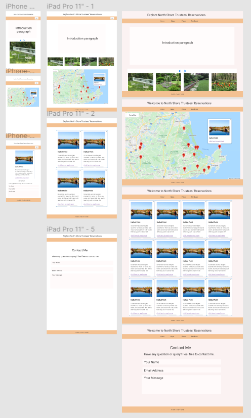

Link to my original wireframes is [here](https://www.figma.com/file/YRGCBPXoM3FqXapNlm10p9/Milestone2?node-id=0%3A1)

## Features

### Existing Features

- One page website - There is only one page for this website. 
- Navbar –  Navbar on the top which allows the user to navigate between the different setions.
- Home setion - A collage picture with photos of the reservations on Northshore.
- Map setion – shows a map with reservations in Northshore marked with markers. When the mouse moves over (on a desktop) or a finger taps a marker a info window pops up shown the picture and the name of that reservation.
- Cards section – a collection of cards with photos and little intros of each reservation. Links under each card will bring user to the Trustees' or Greenbelt's website of that reservation.
- Join us section – has two areas, one for The trustees of Reservations and the other for Greenbelt of Essex County's Land Trust. User can click either link that would bring up a signup website for membership or donations.
- Contact me section - User can contact website owner through the contact form. Each field required to fill up before submission.
- Responsive design

### Future Features

- Map on left side and when the mouse moved over to a marker the information about this place will show up on the right.

## Technologies Used

- [HTML5](https://en.wikipedia.org/wiki/HTML5) - used for project development 
- [CSS3](https://en.wikipedia.org/wiki/Cascading_Style_Sheets) - used for custome styling the elements.
- [GidPod](https://www.gitpod.io/) - used online IDE for project development, code writing and editing
- [Gidhub](https://github.com/) - used for project repository and version control
- [Bootstrap 4](<https://en.wikipedia.org/wiki/Bootstrap_(front-end_framework)>) - used it's library templates for navbars, buttoms and form.
- [Google Chrome Dev Tools](https://developers.google.com/web/tools/chrome-devtools) - used throughout project development for checking the responsiveness and debugging.
- [Reponsive Design Checker](https://responsivedesignchecker.com/) 
- [Figma](https://www.figma.com/) for creating project wireframes.
- [Fontawesome](https://fontawesome.com/) - used for providing social media icons.
- [Javascript](https://www.javascript.com/) - used for scripts of Google map and contact form.
- [EmailJS](https://www.emailjs.com/) - used for emails.
- [Photo resize](https://www.photoresizer.com/) 
- [Photo collage](https://www.photocollage.com/) 
- [Photo resize](https://www.img2go.com/convert-image-to-image)
- [Photo enlarger](https://www.photoenlarger.com/)

## Testing

### Code Validation
HTML code for all pages and CSS stylesheet were validated on [W3C Validator](https://validator.w3.org/nu/#textarea). Errors were corrected.
Errors of stray start tag were found. Errors were corrected by moving script links inside the body.

CSS stylesheet were validated on [W3C Validator](https://validator.w3.org/nu/#textarea). No error found.

### Responsiveness
Responsiveness of the site was tested using [Chrome devtools](https://developers.google.com/web/tools/chrome-devtools), [Responsive Design Checker](https://responsivedesignchecker.com/#home) and [Responsive design](http://ami.responsivedesign.is/#)

### Browser Compatibility
Compatibility of the site was tested on Google Chrome, Microsoft Edge and Firefox.

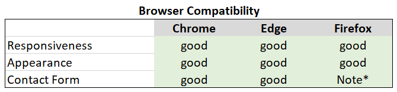

### Testing User Stories
#### As a user
- I can have a brief glance of the reservations in Northshore when the website was opened.
    * through the collage picture.
     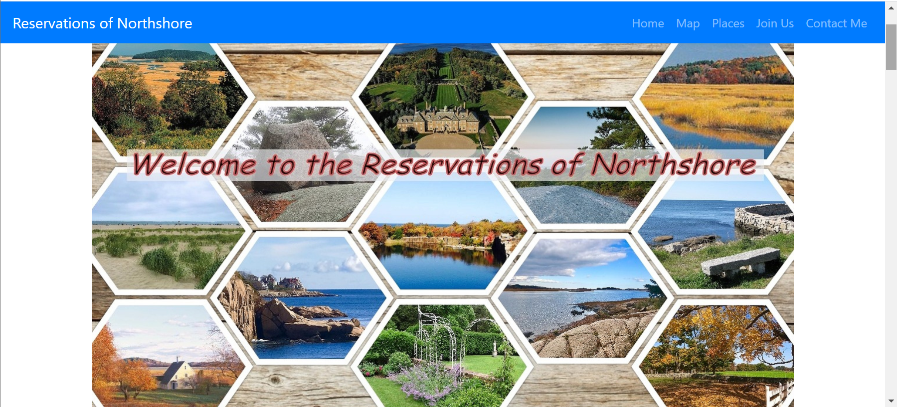 

- I can navigate through different sections in the page.
    * by click or tap the section name on the navbar 
    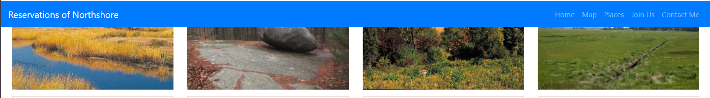  

- I get to know these wonderful reservations in Northshore.
    * by browsing through this website and the through the links to the Trustees and Greenbelt's websites.

- I can clearly see the locations of these places with markers on the Google Map.
    * by scroll down the page or click **Map** on the navbar.
    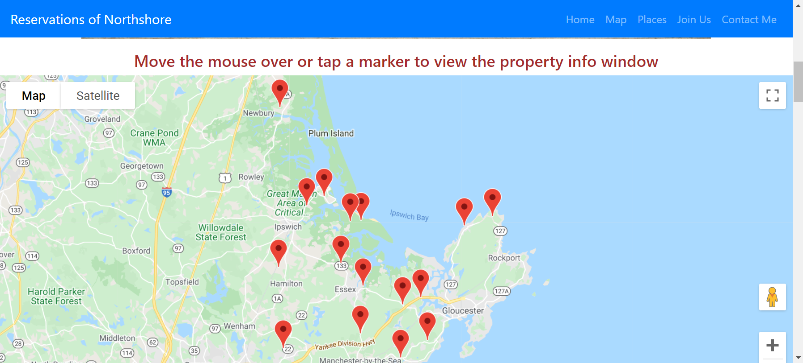

- I can click/move over mouse or tap a maker to see the name and the photo of the reservation.

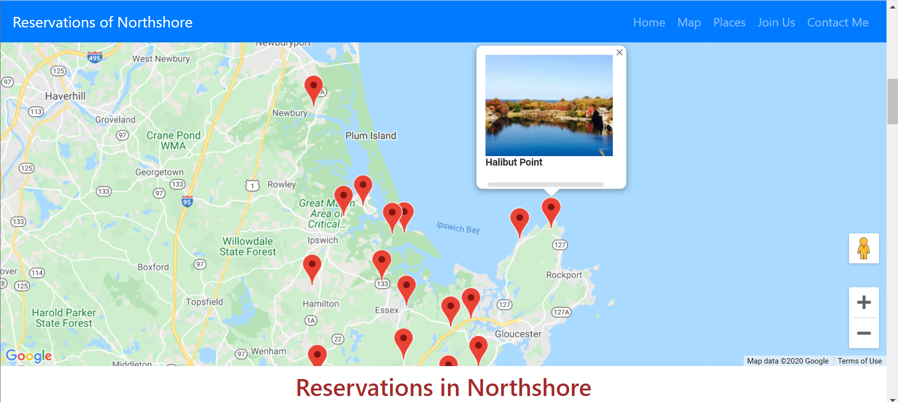

- I can view info cards with photo and infromation about the place.
    * by scroll down the page or click **Places** on the navbar.
    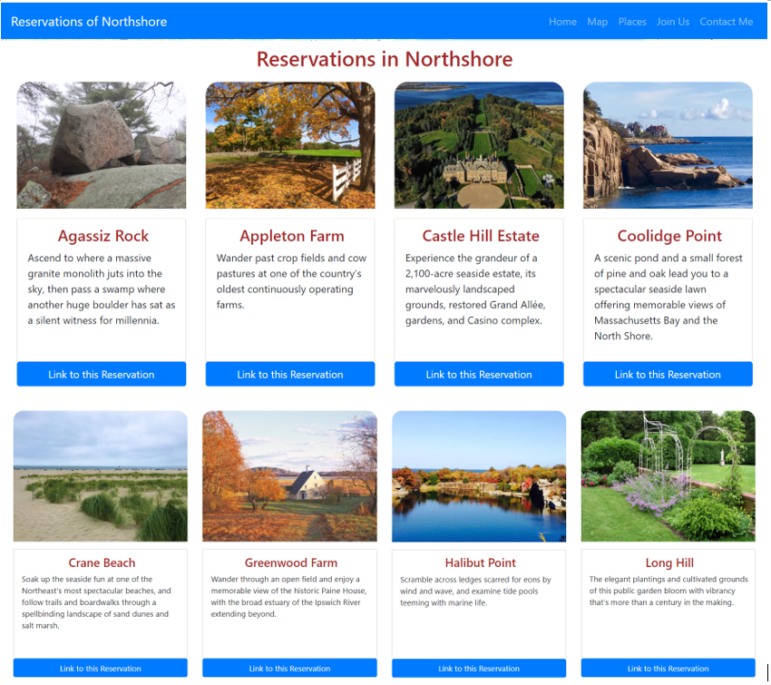

- I can access the web page of each Reservation for more information.
    * by clicking the **Link to this reservation** button. 

- I can sign up to be a member of either the Trustees or the Greenbelt.
    * by clicking the **Join the Trustees** or **Join the Greenbelt** button.
    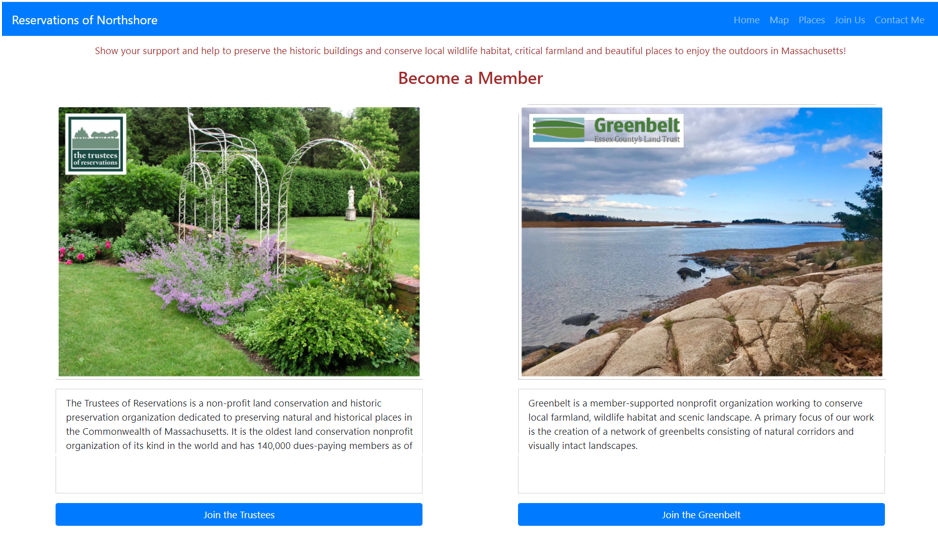

    * A sign up website of Trustees or Greenbelt will popup.
    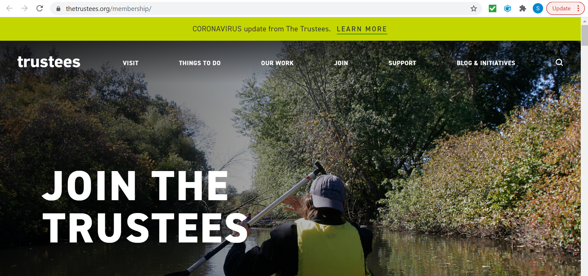
    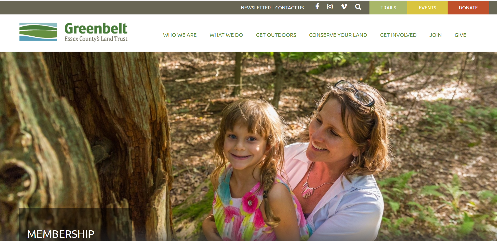 

- I can contact website owner for questions or comments.
    * by filling out the contact form
    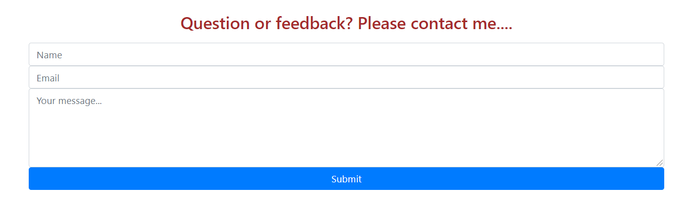
    
#### As a website owner
- I want the users to come and enjoy these beautiful places.
 * by browsing through the website
- I want to introduce users to the great work that Trustees and Greenbelt have done in preserving local lands and histroy.
 * by visiting the websites of these two non-profit organizations.
- I hope people would like to become a member and support the Trustees and Greenbelt.
    * by signing up on **Join Us" section

### Bugs
* Input patterns were not working. Bug fixed with added space.
* Collage image was too small. On large devices it would leave some blank space on the right. Used online photo enlarger website to enlarger the photo. 

## Deployment
The website was deployed to GitHub pages. Link to the site is [here](https://github.com/suping106/MS2-NorthShore-Reservations).

Deployment was done by 
* Logging in to GitHub
* Locating Milestone2 project repository
* Clicking on the settings tab 
* Navigating to "Github pages" section
* Changing the source from none to master branch
* Website was published and link to the website was shown

Clone the repository
* Log in to GitHub
* Locate Milestone2 project repository
* Click the green "Code" button right next to "Gitpod" button
* Copy the link shown on the popup window under "Clone with HTTPS" 
* In Gitpod teminal window make a new directory on your computer
* At the command promt type git clone https://github.com/suping106/milestone1.git
* Press enter
* Local clone repository will be created

## Credits

### Content

- The Trustees of Reservations information and some photos were from [The Trustees of Reservatios](http://www.thetrustees.org/).
- Greenbelt of Essex County's Land Trust information and some photos were from [Greenbelt of Essex County's Land Trust](https://ecga.org/)

### Code
- The code for Navbar was modified from [getbootstrap.com](https://getbootstrap.com/docs/4.0/components/navbar/).
- The code for the Map and Sign Up form was modified from the source code of Interactive Frontend Development module .

### Media

- Most of the photos are owned by me and few of them were downloaded from the Trustees and Greenbelt websites.

### Acknowledgements

- I would like to thank my mentor [Precious Ijege](https://www.linkedin.com/in/precious-ijege-908a00168/) for his support, help, patience and encouragements. I am also grateful for the helps from tutors and slack members.
